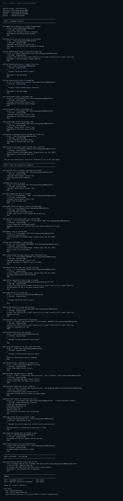

# Assignment Kong POC Implementation

## Overview

This project dockerizes a small Node.js application and places it behind Kong API Gateway.
Jenkins builds the images, starts the application services, runs the verification suite, and
publishes the generated HTML report. The setup is intended for local evaluation and is not a
production deployment.

## Assignment Coverage

| Requirement | Delivered | Main files |
| --- | --- | --- |
| Dockerize and deploy the sample application | Yes | `app/server.js`, `app/Dockerfile`, `docker-compose.yml` |
| Configure Kong service, routes, and consumers | Yes | `kong/kong.yml` |
| Configure Key Authentication and Rate Limiting | Yes | `kong/kong.yml` |
| Validate the `x-environment` header | Yes | `kong/plugins/x-environment-validator/` |
| Automate build and testing with Jenkins | Yes | `Jenkinsfile`, `jenkins/` |
| Apply containerization and security practices | Yes | Dockerfiles, Compose configuration, `.gitignore` |
| Provide documentation, commands, and evidence | Yes | `README.md`, this report, `tests/test.sh` |

## How It Works

```text
Client -> Kong proxy -> Express backend
             |
             +-- x-environment-validator
             +-- key-auth
             +-- rate-limiting

Jenkins runs the same test script against the Compose network.
```

The backend exposes `/health`, `/api/ping`, `/api/hello`, and `/api/data`. Kong runs in DB-less
mode and loads the version-controlled configuration from `kong/kong.yml`. The configured routes
are:

| Route | Protection |
| --- | --- |
| `/health` | Open for health checks |
| `/api/ping` | Rate limiting, 100 requests per minute |
| `/api/hello` | Environment validation and rate limiting, 50 requests per minute |
| `/api/data` | Key authentication and rate limiting, 30 requests per minute |

The registered consumers are `demo-user` and `test-user`.

## Custom Plugin and Error Handling

The `x-environment-validator` plugin accepts `DEV`, `UAT`, and `PROD`. Matching is
case-insensitive and surrounding spaces are removed. It returns JSON responses through the Kong
PDK, so plugin errors do not expose an HTML error page or an internal stack trace.

| Situation | Response |
| --- | --- |
| Header missing or empty | `400` with `Missing x-environment header` |
| Header value is invalid | `403` with the allowed values |
| Header is valid | Request continues to the backend |
| Header is sent more than once | `400`, because the intended environment is ambiguous |
| Invalid value on a route without the plugin | Route continues normally, proving route-level scope |

The backend returns JSON for unknown paths (`404`), malformed JSON (`400`), and request bodies
over 10 kB (`413`). If the backend is stopped, Kong returns an upstream `502` or `503` while the
gateway remains available; traffic recovers after the backend restarts.

## Test Case Suites

Run the suite after the stack is running:

```bash
docker compose up -d
docker compose --profile ci up --build --abort-on-container-exit pipeline
```

The script supports host and container addresses through `KONG_URL`, `ADMIN_URL`, and
`BACKEND_URL`. Jenkins uses these container-network values:

```text
Kong proxy  http://kong:8000
Kong admin  http://kong:8001
Backend     http://backend:5000
```

### Part A: Assignment Scenarios

These 11 cases map directly to the assignment requirements.

| IDs | Suite coverage |
| --- | --- |
| A1-A2 | Docker deployment, Kong service, route, and backend proxying |
| A3-A5 | Registered, missing, and unknown API keys |
| A6-A10 | Valid, missing, and invalid `x-environment` values |
| A11 | Rate limiting returns `429` after the route quota is exceeded |

### Part B: Edge Cases

These 22 cases demonstrate behavior a reviewer should expect at boundaries.

| IDs | Suite coverage |
| --- | --- |
| B1-B7 | Case, whitespace, empty, duplicate, numeric, and near-miss header values |
| B8-B9 | Plugin route scoping and JSON error responses |
| B10-B13 | Query-string keys, empty keys, the second consumer, and plugin independence |
| B14-B16 | Unrouted paths, wrong methods, and backend JSON `404` responses |
| B17-B18 | Malformed JSON and oversized request bodies |
| B19 | `RateLimit-*` response headers |
| B20-B22 | Backend outage, Kong health, and recovery after restart |

The suite exits with a non-zero status when a case fails. `SKIP_RATELIMIT=1` and
`SKIP_RESILIENCE=1` can skip destructive or timing-sensitive sections; a normal run skips
nothing. The same script is used manually and by Jenkins, which keeps the evidence consistent.

## Verification Evidence

The following output is representative of the completed run generated on 2026-08-23. The HTML
report is generated by `tests/test.sh` and served at `http://localhost:8090/`.

```text
Kong proxy : http://kong:8000
Kong admin : http://kong:8001
Backend    : http://backend:5000

Part A  Assignment Scenarios                   11/11 passed
Part B  Edge Cases (beyond the assignment)     22/22 passed

Passed 33   Failed 0   Skipped 0
Finished: SUCCESS
```

Representative API checks:

```text
GET /api/hello with x-environment: DEV -> 200
GET /api/hello without x-environment -> 400
GET /api/hello with x-environment: STAGING -> 403
GET /api/data without an API key -> 401
Rate-limit burst on /api/data -> 200 responses followed by 429 responses
```

## Console Output Evidence

The test script prints each command, expected status, actual status, response, and final
`PASS` or `FAIL` result. These are the important checks a reviewer can verify from the console:

```text
[A9] Missing x-environment returns HTTP 400 with a JSON error
    $ curl -i http://kong:8000/api/hello
    -> HTTP 400   (expected 400)
    {"error":"Missing x-environment header"}
    PASS

[B5] Duplicate x-environment headers are rejected (400)
    $ curl -i -H "x-environment: DEV" -H "x-environment: PROD" http://kong:8000/api/hello
    -> HTTP 400   (expected 400)
    {"error":"Duplicate x-environment header"}
    PASS

[B18] Oversized request body returns a JSON 413
    -> HTTP 413   (expected 413)
    PASS

[A11] Rate limiting throttles a burst with HTTP 429
    30 responses were 200, 10 were 429 (route limit is 30 per minute)
    PASS
```

## Important Edge Cases

The edge-case suite confirms that the gateway fails clearly and does not silently accept
ambiguous or unsafe input:

* Empty or missing `x-environment` is rejected with `400`.
* Duplicate environment headers are rejected with `400` instead of using the first value.
* Case and surrounding spaces are handled for valid values; near-miss values are still rejected.
* Malformed JSON returns `400`, and a body over 10 kB returns `413`.
* Missing or invalid API keys return `401`; a key on the query string is tested separately.
* When the backend is stopped, Kong returns `502` or `503`, remains healthy, and recovers after
  the backend restarts.

## Screenshot Evidence

The following screenshot shows the complete CLI output from the real verification run. It
includes every `curl` command, the returned HTTP status and response, all assignment scenarios,
the important edge cases, and the final result.



The complete captured output is available in [console-run-output.txt](console-run-output.txt).

## Container and Pipeline Notes

The backend image uses `node:18-alpine`, installs production dependencies only, and runs as the
non-root `node` user. Healthchecks use a Node HTTP probe against `127.0.0.1`. Kong uses a
self-contained DB-less image with the custom plugin included. Jenkins is configured as code and
runs the pipeline against the shared Compose network.

The local Jenkins image runs as root and mounts the Docker socket so it can build and control the
test containers. This is convenient for the assignment but should be replaced with a restricted
CI design in production. Rate limiting uses local counters, so a multi-node deployment would
need shared storage such as Redis for a global limit.

## Reproduction

```bash
docker compose build
docker compose up -d
docker compose --profile ci up --build --abort-on-container-exit pipeline
```

Open the generated report at `http://localhost:8090/`. For setup, service links, and
troubleshooting steps, see the [project documentation in README.md](../README.md).
